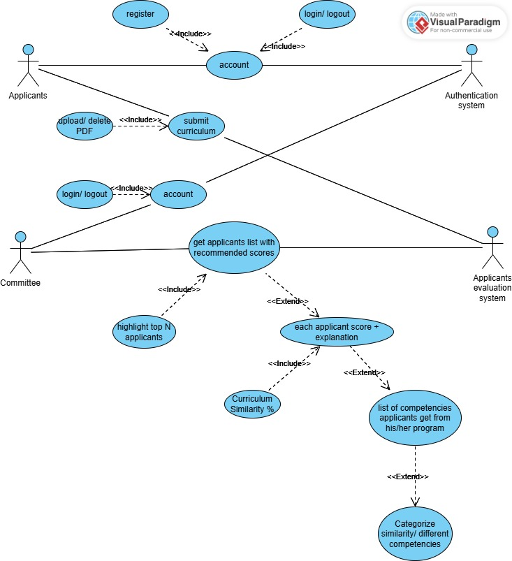

### Functional Requirements
1. **Accessibility**
   - The software must allow users to log into their accounts using their TUM staff email and password.
   - The software must deny access to unauthorized individuals, including TUM staff and students who are not involved in admission assessment tasks.

2. **Document Reading**
   - The software must allow users to upload applicants’ documents (module handbook, curricular analysis form) in PDF format.
   - The software must be able to read the curricular analysis content structured in a table within the PDF, extracting courses that match TUM mandatory courses, course credits, the applicant’s grade, and the highest and lowest possible grades.
   - The software must be able to read module handbooks with various structures from different universities and extract course content.

3. **Curricular Analysis Assessment**
   - The software must list the competencies a student can acquire from a course, based on the course content extracted from the module handbook.
   - The software must compare the competencies TUM students acquire from mandatory courses with the competencies applicants acquire from their courses, returning the percentage of similarity, and listing similar and different competencies.
   - The software must compare the scale (in ECTS credits) of TUM courses to the applicant’s courses.
   - The software must provide a recommended score for the curricular analysis based on competency similarity, course scale, and the applicant’s grade, with a clear explanation.
   - The software must allow users to download the recommended score and explanations as a PDF or XLS file.
   - The software must recommend the top N highest-scoring applicants, where N is the number of admissions allowed.

4. **Data Storage**
   - For each applicant, the software must store their name, ID, recommended score.
   - For each user, the software must store their username, TUM email address, and password.

5. **Security**
   - All stored data must be encrypted.

6. **Reusability**
   - The software must be developed to allow reuse in annual admission assessments and to facilitate easy maintenance.

### Non-Functional Requirements

1. **Usability**
   - The system should provide a user-friendly interface for the selection committee, making it easy to navigate and use without extensive training.
   - Clear visualization of recommendations should be included to aid decision-making.

2. **Performance**
   - The LLM-based evaluation system should process and analyze application materials within a reasonable timeframe (under 10 seconds per application) to ensure timely evaluation during peak application periods.
   - The system must handle concurrent requests from multiple users (at least 20 simultaneous users) without performance degradation.

3. **Reliability**
   - The system should have an uptime of at least 99.5% to ensure availability during critical application evaluation periods.
   - The evaluation algorithms should consistently provide accurate recommendations with minimal errors in scoring and ranking.

4. **Scalability**
   - The system should be scalable to accommodate an increase in the number of applications, especially during peak admission cycles.
   - The backend infrastructure should support scaling to analyze data from diverse programs and courses without requiring substantial reconfiguration.

5. **Security**
   - The system must ensure the confidentiality of applicant data by implementing robust encryption methods for data storage and transmission.
   - Only authorized personnel should have access to the application data, with user authentication and role-based access controls enforced.

6. **Fairness and Transparency**
   - Evaluation algorithms must be fair and unbiased, ensuring no discrimination based on any personal or demographic attributes.
   - The scoring methodology and evaluation process should be transparent, with explanations available for each recommendation.

7. **Maintainability**
   - The codebase should be modular and well-documented to facilitate easy updates and maintenance by future developers.
   - System components should be designed to allow for easy modification of evaluation criteria as the university’s admission policies evolve.

8. **Compliance**
   - The system should comply with relevant data protection regulations, such as GDPR, ensuring that applicants’ personal data is handled responsibly.
   - The evaluation and recommendation criteria should align with the Technical University of Munich’s admission standards and policies.

## Use Case Diagram
   This is the Use Case Diagram for our software. 
   
   
